<!--
SPDX-FileCopyrightText: Ali Sajid Imami

SPDX-License-Identifier: MIT
-->

# Random Wait Action

Add configurable jitter to GitHub Actions jobs. Random Wait Action pauses a
job for a randomly selected number of seconds, helping stagger parallel
requests and reduce synchronized bursts against APIs, registries, deployment
targets, and other shared services.

```yaml
- name: Stagger parallel requests
  uses: AliSajid/random-wait-action@v3
  with:
      minimum: 5
      maximum: 30
```

## Why use it?

GitHub Actions matrix jobs often begin at nearly the same time. When every job
immediately contacts the same external service, individually reasonable
requests can become a short, concentrated burst. Adding jitter can spread
those requests over a configurable interval, lowering the burst-pressure.

This action was inspired by an incident where a matrix of 12 jobs was updating
the same Gist together, leading to errors for later jobs. Adding a small
randomized delay allowed the jobs to complete successfully.

> [!NOTE]
> Randomized delay is not a replacement for retries, exponential backoff,
> GitHub Actions concurrency controls, or provider-specific rate-limit
> handling. It addresses the narrower problem of unnecessary and unintended
> synchronization.

```mermaid
gantt
    title Parallel jobs with and without randomized jitter
    dateFormat  HH:mm:ss
    axisFormat  %S.%L s

    section Without jitter
    All Jobs Wait            :active, w0, 00:00:00, 1s
    Job 1 runs              :w1, after w0, 2s
    Job 2 runs              :w2, after w0, 2s
    Job 3 runs              :w3, after w0, 2s
    Shared API burst        :milestone, crit, wb, 00:00:03, 0s

    section With jitter
    Job 1 waits             :active, j1w, 00:00:00, 2s
    Job 1 runs              :j1, after j1w, 2s
    API Response Job 1      :milestone, crit, after j1
    Job 2 waits             :active, j2w, 00:00:00, 3s
    Job 2 runs              :j2, after j2w, 2s
    API Response Job 2      :milestone, crit, after j2, 0s
    Job 3 waits             :active, j3w, 00:00:00, 1s
    Job 3 runs              :j3, after j3w, 2s
    API Response Job 3      :milestone, crit, after j3, 0s

```



## Usage

### Use the current major release

```yaml
- name: Add randomized delay
  id: random-wait
  uses: AliSajid/random-wait-action@v3
  with:
      minimum: 5
      maximum: 30
- name: Show selected delay
  run: echo "Waited ${{ steps.random-wait.outputs.wait_time }} seconds"
```

### Pin an immutable commit

For hardened workflows, pin the action to the full commit SHA for the v3.0.0
release and keep the human-readable version in a comment.

```yaml
- name: Add randomized delay
  uses: AliSajid/random-wait-action@V3_SHA # v3.0.0
  with:
      minimum: 5
      maximum: 30
```

## Common use cases

- Stagger matrix jobs before they call the same API.
- Spread deployment or provisioning requests over a short interval.
- Reduce synchronized requests to package registries, badge services, or
  shared test infrastructure.
- Introduce timing variation when testing order-independent workflows.

## When not to use it

Use GitHub Actions concurrency controls when you need a hard limit on
simultaneous jobs. Use retries with exponential backoff when a service asks
clients to retry failed requests. Use provider-specific rate-limit headers
and quotas when available. Random Wait Action is most useful when the jobs
may still run concurrently but should not begin the sensitive operation at
exactly the same time.

## Inputs

| Input     | Description                   | Required | Default |
| --------- | ----------------------------- | -------- | ------- |
| `minimum` | Minimum wait time in seconds. | No       | `1`     |
| `maximum` | Maximum wait time in seconds. | No       | `10`    |

## Outputs

| Output      | Description                        |
| ----------- | ---------------------------------- |
| `wait_time` | The selected wait time in seconds. |

## Version compatibility

- `v3` uses the Node 24 GitHub Actions runtime.
- `v2` remains available for older self-hosted environments but is
  maintenance-only.
- Node 24 is incompatible with macOS 13.4 and earlier and does not officially
  support ARM32 self-hosted runners.

## Security

The action requests no GitHub token permissions and does not make
network requests. For high-assurance workflows, pin the action to an immutable
full commit SHA. See [`SECURITY.md`](SECURITY.md) and
[`SECURITY_ASSURANCE.md`](SECURITY_ASSURANCE.md) for the project's support and
assurance information.
